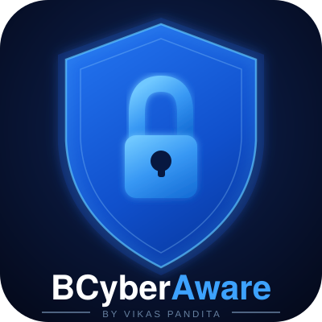

  

<h1 align="center">BCyberAware</h1>

  <strong>AI-powered Threat Intelligence Dashboard</strong> 
  <em>by Vikas Pandita</em>

  
  
  

---

## About

BCyberAware is an AI-powered Threat Intelligence Dashboard designed to help individuals and organisations stay informed about the latest cybersecurity threats, vulnerabilities, and best practices.

## Features

- Real-time threat intelligence feeds
- AI-driven threat analysis and scoring
- Interactive security dashboard
- Actionable cybersecurity insights

---

  Built with passion by <strong>Vikas Pandita</strong>

